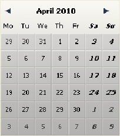
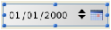

# 🧩 DatePicker und DateEntry

Das Widget DatePicker ist ein intuitives, leicht einzusetzendes Objekt, über das Sie Felder, die ein Datum benötigen, attraktiver darstellen können. Dieses Widget ist in zwei Formen verfügbar:

* **DatePicker Kalender**: Dieses Objekt lässt sich entweder in einem Unterformular verwenden oder als Pulldown Kalender, der durch Anklicken einer Schaltfläche erscheint.
* **DateEntry Bereich**: Datumsbereich, der einer Steuerschaltfläche zugewiesen wird. Dieses Objekt lässt sich nur in einem Unterformular verwenden.

## DatePicker Kalender

Ein DatePicker Kalender zeigt jeden Monat als Tabelle mit Tagen an. Der Benutzer kann während der Ausführung über die Pfeile am oberen Rand in den Kalendermonaten vor- und zurückblättern. Er kann dazu aber auch die Pfeiltasten auf der Tastatur verwenden.

Beim Einfügen in ein Unterformular ist das Objekt DatePicker ohne Programmierung verwendbar. Die Funktionsweise wird über die gebundene (bound) Variable gesteuert: Sie können die Anzeige und Eingabe über den Wert dieser Variable steuern, die an das Objekt Unterformular gebunden ist (Eigenschaft "Variablenname" in der Eigenschaftenliste).  
Beim Ausführen des Formulars enthält diese Datumsvariable automatisch das vom Benutzer ausgewählte Datum. Ändern Sie umgekehrt den Wert dieser Variablen per Programmierung, erscheint er automatisch im Unterformular.

Wollen Sie dagegen diese Funktionsweise anpassen oder das Objekt als PopUp-Menü anzeigen, müssen Sie den Satz mitgelieferter Komponentenmethoden verwenden.

### Verwendung in einem Unterformular

Sie können einen DatePicker Kalender in ein Formular auf zwei Arten einfügen:

* Durch Einfügen eines "Date Picker" Objekts aus der vorkonfigurierten Objektbibliothek von 4D
* Durch Erstellen eines Bereichs Unterformular und Zuweisung des Detailformulars von **DatePicker**.

Sie können diesen Bereich über den Mechanismus der gebundenen (bound) Variable ohne Programmierung steuern (siehe oben).

### Verwendung in einem PopUp

Sie können einen DatePicker Kalender als PopUp-Fenster verwenden. Dazu können Sie entweder:

* ein Objekt "PopUp Datum" aus der vorkonfigurierten Objektbibliothek einfügen,
* ein Unterformular erstellen und das Detailformular **DateButton** zuweisen.  
    In beiden Fällen können Sie die Anzeige und Eingabe durch Einbinden einer Datumsvariable mit dem Objekt verwalten.
* ein Objekt anlegen, das die [DatePicker Display Dialog](Methods/Methods/DatePicker%20Display%20Dialog.de.md) Komponentenmethode aufruft. Diese Methode gibt das vom Benutzer gewählte Datum zurück.

## DateEntry Bereich

Ein Eingabebereich für Datum erleichtert die Eingabe eines Datums im Format, das in den Systemeinstellungen angegeben ist (z. B. TT/MM/JJ).  
Der Bereich erscheint als Datumstyp mit Schaltflächen:

Während der Ausführung erscheinen die Schaltflächen rechts neben dem Eingabebereich nur, wenn das Objekt den Fokus hat. Der Benutzer wählt durch Anklicken oder mit der Tabulatortaste jedes Element einzeln aus (Tag, Monat oder Jahr) und kann mit dem Zähler oder den Pfeiltasten der Tastatur darin scrollen. Über das Kalender-Icon rechts kann er ein Datum aus dem DatePicker PopUp-Kalender auswählen.

Ein DateEntry Objekt ist ohne Programmierung verwendbar. Die Funktionsweise wird über die gebundene (bound) Variable gesteuert (siehe den Abschnitt "DatePicker Kalender"). Wollen Sie dagegen diese Funktionsweise anpassen, können Sie den Satz mitgelieferter Komponentenmethoden verwenden. Die Methoden sind dieselben wie für das Objekt DatePicker.

### Verwendung in einem Unterformular

Sie können einen DateEntry Bereich auf zwei Arten in ein Formular einfügen:

* Durch Einfügen eines Objekts "DateEntry" aus der vorkonfigurierten Objektbibliothek von 4D.
* Durch Erstellen eines Bereichs Unterformular und Zuweisen des Detailformulars **DateEntry**.
