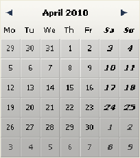
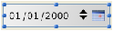

# 🧩 DatePicker et DateEntry  

Le widget DatePicker est un objet intuitif et très simple d’emploi que vous pouvez utiliser pour valoriser tout champ nécessitant la saisie d’une date ou simplement pour représenter une date. Ce widget est proposé sous deux formes :   

* **Calendrier DatePicker** : cet objet est utilisable soit dans un sous-formulaire, soit en tant que calendrier déroulant affiché par un clic sur un bouton.
* **Zone DateEntry** : zone de date associée à des boutons de contrôle. Cet objet est utilisable dans un sous-formulaire uniquement.

## Calendrier DatePicker  

Un calendrier DatePicker est une zone affichant un mois sous forme de tableau de jours. En exécution, l’utilisateur peut faire défiler les mois du calendrier vers l’avant ou vers l’arrière en cliquant sur des boutons en forme de flèche. Il peut également utiliser les touches fléchées du clavier.

Lorsqu’il est inséré dans un sous-formulaire, un objet DatePicker peut être utilisé sans programmation grâce au mécanisme fourni par la **variable associée** : vous pouvez manipuler la valeur de la variable associée à l'objet sous-formulaire (propriété "Nom de la variable" dans la Liste des propriétés) afin de gérer l'affichage et la saisie.  
A l’exécution du formulaire, cette variable date contiendra automatiquement la date sélectionnée par l’utilisateur. A l’inverse, si vous modifiez par programmation la valeur de cette variable, elle sera automatiquement représentée dans le sous-formulaire.

Toutefois, si vous souhaitez personnaliser le fonctionnement du DatePicker ou l’afficher sous forme de menu pop-up, vous devez utiliser l’ensemble de méthodes composant qui est fourni.

### Utilisation en sous-formulaire  

Vous pouvez insérer un calendrier DatePicker dans un formulaire de deux manières :

* en insérant un objet "Date Picker" depuis la bibliothèque d’objets préconfigurée de 4D
* en créant une zone de sous-formulaire et en lui associant le formulaire détaillé **DatePicker**.

Vous pouvez gérer cette zone sans programmation via le mécanisme de la variable associée (cf. ci-dessus).

### Utilisation dans un pop-up  

Vous pouvez utiliser un calendrier DatePicker sous forme de fenêtre pop-up. Pour cela, vous pouvez soit :

* insérer un objet "Pop up date" de la bibliothèque d'objets préconfigurés,
* créer un sous-formulaire et lui associer le formulaire détaillé **DateButton**.  
    Dans ces deux cas, vous pouvez gérer l'affichage et la saisie en associant une variable date à l'objet.
* créer un objet qui appelle la méthode composant [DatePicker Display Dialog](Methods/DatePicker%20Display%20Dialog.fr.md). Cette méthode retourne la date sélectionnée par l’utilisateur.

## Zone DateEntry  

Une zone de type DateEntry facilite la saisie d’une date sous la forme définie dans les préférences système (par exemple JJ/MM/AA).  
La zone se présente sous la forme d’une date de type associée à des boutons :

En exécution, les boutons situés à droite de la zone de saisie ne s’affichent que lorsque l’objet a le focus. L’utilisateur sélectionne individuellement chaque élément de la date (jour, mois ou année) via un clic ou la touche Tabulation et peut le faire défiler en utilisant le stepper numérique ou les touches fléchées du clavier. L’icône calendrier situé à droite permet de sélectionner une date par l’intermédiaire d’un calendrier déroulant DatePicker.

Un objet DateEntry peut être utilisé sans programmation grâce au mécanisme fourni par la variable associée (cf. paragraphe "Calendrier DatePicker"). Toutefois, si vous souhaitez en personnaliser le fonctionnement, vous pouvez utiliser l’ensemble de méthodes composant qui est fourni. Ces méthodes sont les mêmes que celles de l’objet DatePicker.

### Utilisation en sous-formulaire  

Vous pouvez insérer une zone DateEntry dans un formulaire de deux manières :

* en insérant un objet "Zone de saisie de date" depuis la bibliothèque d’objets préconfigurée de 4D.
* en créant une zone de sous-formulaire et en lui associant le formulaire détaillé **DateEntry**.
