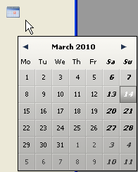

# DatePicker Display Dialog

> DatePicker Display Dialog {( Links ; Oben {; Standarddatum})} -> Funktionsergebnis

| Parameter | Type |     | Description |
| --- | --- | --- | --- |
| Links | Lange Ganzzahl | → | Stelle für linken Rand des Fensters |
| Oben | Lange Ganzzahl | → | Stelle für oberen Rand des Fensters |
| Standarddatum | Datum | → | Datum, das im Dialog standardmäßig ausgewählt wird |
| Funktionsergebnis | Datum | ➡️ | Vom Benutzer ausgewähltes Datum |

## Beschreibung

Die Funktion DatePicker Display Dialog öffnet einen Kalender in einem PopUp Fenster (Ein Fenster vom Typ PopUp wird automatisch geschlossen, wenn der Benutzer außerhalb des Fensters klickt oder die **Enter**- bzw. **Esc-Taste** drückt).



Die beiden optionalen Parameter `Links` und `Oben` definieren die Position der linken oberen Ecke des zu öffnenden Fensters. Die Parameter müssen zusammen übergeben werden; Ist nur ein Parameter übergeben, wird er ignoriert. Werden diese Parameter weggelassen, wird das Fenster an der Stelle des Mausklicks geöffnet.

Sie können als dritten Parameter `Standarddatum` übergeben, damit im Dialogfenster DatePicker ein zugewiesenes Datum ausgewählt wird, wenn es für den Benutzer angezeigt wird.

DatePicker Display Dialog gibt das Datum zurück, welches der Benutzer im DatePicker Kalender ausgewählt hat. Wird das Fenster ohne ausgewähltes Datum geschlossen, gibt die Funktion ein leeres Datum zurück (!00/00/00!), selbst wenn der Parameter `Standarddatum` übergeben wurde.

### Beispiel  

Dieses Beispiel zeigt einen DatePicker Kalender, wenn auf eine Schaltfläche geklickt wird:

```4d
 OBJECT GET COORDINATES(*;"MyCalendarButton";$x1;$y1;$x2;$y2)  
 $MyLocalDate:=DatePicker Display Dialog($x1;$y1)  
 If($MyLocalDate #!00.00.00!)  
    [Event]DateRV:=$MyLocalDate  
 End if
```
