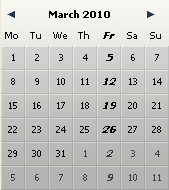

# DatePicker SET DAYS OFF

> DatePicker SET DAYS OFF ( ObjektName {; TagTyp ; ZgrFeiertageArray} )

| Parameter | Type |     | Description |
| --- | --- | --- | --- |
| ObjektName | Text | → | Name des Objekts Unterformular |
| TagTyp | Lange Ganzzahl | → | Art der Feiertage |
| ZgrFeiertageArray | Zeiger | → | Zeiger auf Array Datum mit Feiertagen |

## Beschreibung

Der Befehl `DatePicker SET DAYS OFF` setzt die Feiertage, die im Kalender DatePicker erscheinen sollen. Diese Tage erscheinen in fett und kursiv und bleiben für den Benutzer auswählbar.

Der Parameter `ObjektName` spezifiziert die Instanz des Unterformulars, für welche die Funktion gelten soll. In diesem Parameter übergeben Sie den Namen des Objekts Unterformular, das im aktuellen Formular angezeigt wird.

Mit diesem Befehl können Sie sowohl wöchentlich oder jährlich wiederkehrende freie Tage als auch bewegliche Feiertage setzen. Die Art des freien Tages setzen Sie im Parameter `TagTyp`:

* 0 = Wöchentlich auftretende freie Tage (standardmäßig Samstag und Sonntag)
* 1 = Feste Feiertage, die sich jedes Jahr wiederholen, wie z.B. 1. Januar oder 25. Dezember)
* 2 = bewegliche Feiertage, die für ein einzelnes Jahr gelten, z.B. Ostermontag

Um die Feiertage zu setzen, erstellen Sie ein Array und übergeben im Parameter `ZgrFeiertageArray` einen Zeiger auf dieses Array. Sein Typ richtet sich nach dem in `TagTyp` übergebenen Wert:

* Übergeben Sie 0 in `TagTyp` (wöchentliche freie Tage) müssen Sie in `ZgrFeiertageArray` einen Zeiger auf ein Array vom Typ Boolean mit 7 Elementen übergeben. Jedes auf Wahr gesetzte Element gibt einen freien Tag in der Woche an.
* Übergeben Sie 1 oder 2 in `TagTyp` (jährliche oder bewegliche freie Tage) müssen Sie in `ZgrFeiertageArray` einen Zeiger auf ein Array vom Typ Datum übergeben. In diesem Array muss jedes Element ein gültiges Datum für einen Feiertag enthalten. Die Datumsangaben müssen im Standardformat der Systemsprache ausgedrückt werden. Haben Sie 1 im Parameter `TagTyp` übergeben (wiederkehrende Tage), wird das Jahr ignoriert; Sie können jeden Wert übergeben.

### Beispiel 1  

Freitag als freien Tag bezeichnen, anstatt der Standardeinstellung Samstag und Sonntag:

```4d
 ARRAY BOOLEAN($arrbDaysOff;7)  
  //Standardmäßig sind alle Elemente eines Boolean Array Falsch; deshalb muss kein Code zur Initialisierung hinzugefügt werden.
 $arrbDaysOff{Friday}:=True  
 DatePicker SET DAYS OFF("mycalendar";0;->$arrbDaysOff)
```



### Beispiel 2  

Bezeichnung beweglicher Feiertage, z.B. Ostermontag:

```4d
 ARRAY DATE($arrdUniqueDays;0)  
  //Das Jahr wird berücksichtigt  
 APPEND TO ARRAY($arrdUniqueDays;!02/15/2008!)  
 APPEND TO ARRAY($arrdUniqueDays;!02/12/2009!)  
 APPEND TO ARRAY($arrdUniqueDays;!02/17/2010!)  
 DatePicker SET DAYS OFF(1;->$arrdUniqueDays)
```

## Siehe auch

[DatePicker SET DEFAULT DAYS OFF](DatePicker%20SET%20DEFAULT%20DAYS%20OFF.de.md)  
[DatePicker SET WEEK FIRST DAY](DatePicker%20SET%20WEEK%20FIRST%20DAY.de.md)
