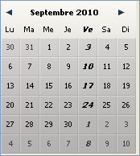

# DatePicker SET DAYS OFF

> DatePicker SET DAYS OFF ( nomObjet {; typeJour ; ptrTabJoursCongés} )

| Paramètre | Type |     | Description |
| --- | --- | --- | --- |
| nomObjet | Texte | → | Nom d'objet sous-formulaire |
| typeJour | Entier long | → | Types de jours fériés |
| ptrTabJoursCongés | Pointeur | → | Pointeur vers le tableau date ou booléen des jours de congés |

## Description

La commande DatePicker SET DAYS OFF permet de définir les "jours de congés" à faire figurer dans le calendrier DatePicker. Ces jours sont affichés en gras italique et restent sélectionnables par l'utilisateur. 

Le paramètre `nomObjet` désigne l'instance de sous-formulaire à laquelle la commande doit être appliquée. Vous devez passer dans ce paramètre un nom d'objet sous-formulaire affiché dans le formulaire courant. 

La méthode composant permet de définir des jours de congés récurrents hebdomadaires ou annuels ainsi que des jours "fériés" ponctuels. Vous précisez le type de jour de congé défini par la méthode via le paramètre `typeJour` :

* 0 = jours de congés répétés chaque semaine (par défaut, le samedi et le dimanche)
* 1 = jours de congés répétés d'année en année (tels que le 1er janvier ou le 25 décembre)
* 2 = jours fériés ponctuels, définis pour une seule année

Vous définissez les jours à l'aide d'un tableau et en passant un pointeur vers ce tableau comme paramètre `ptrTabJoursCongés`. Le type de tableau dépend de la valeur passée dans `typeJour` :

* Si vous avez passé 0 dans `typeJour` (jours de congés hebdomadaires), vous devez passer dans `ptrTabJoursCongés` un pointeur vers un tableau booléen comportant 7 éléments. Chaque élément à Vrai désigne un jour de congé hebdomadaire.
* Si vous avez passé 1 ou 2 dans `typeJour` (jours de congés annuels ou ponctuels), vous devez passer dans `ptrTabJoursCongés` un pointeur vers un tableau date. Dans ce tableau, chaque élément doit contenir une date valide, indiquant un jour de congé. Les dates doivent être exprimées dans le format par défaut correspondant à la langue du système. Si vous avez passé 1 dans `typeJour` (jours récurrents), l'année est ignorée, vous pouvez passer n'importe quelle valeur.

### Exemple 1

Désignation du vendredi comme jour de congé hebdomadaire (au lieu des samedi et dimanche par défaut) :

```4d
 TABLEAU BOOLEEN($arrbDaysOff;7)  
  //Par défaut, tous les éléments d'un tableau booléen sont à Faux, il n'est donc pas nécessaire d'ajouter du code d'initialisation  
 $arrbDaysOff{Vendredi}:=Vrai  
 DatePicker SET DAYS OFF("moncalendrier";0;->$arrbDaysOff)
```



### Exemple 2

Désignation de jours fériés ponctuels :

```4d
 TABLEAU DATE($arrdUniqueDays;0)  
  //L'année est prise en compte  
 AJOUTER A TABLEAU($arrdUniqueDays;!15/02/2008!)  
 AJOUTER A TABLEAU($arrdUniqueDays;!12/02/2009!)  
 AJOUTER A TABLEAU($arrdUniqueDays;!17/02/2010!)  
 DatePicker SET DAYS OFF("moncalendrier";2;->$arrdUniqueDays)
```

## Voir aussi

[DatePicker SET DEFAULT DAYS OFF](DatePicker%20SET%20DEFAULT%20DAYS%20OFF.fr.md)  
[DatePicker SET WEEK FIRST DAY](DatePicker%20SET%20WEEK%20FIRST%20DAY.fr.md)
