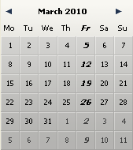

# DatePicker SET DAYS OFF

> DatePicker SET DAYS OFF ( objectName {; dayType ; ptrDaysOffArray} )

| Parameter | Type |     | Description |
| --- | --- | --- | --- |
| objectName | Text | ⬅️ | Name of subform object |
| dayType | Longint | ⬅️ | Types of days off |
| ptrDaysOffArray | Pointer | ⬅️ | Pointer to date or Boolean array of days off |
## Description

The DatePicker SET DAYS OFF command is used to set the days off to appear in the DatePicker calendar. These days are displayed in bold and italic and remain selectable for the user.

The [objectName](# "Name of subform object") parameter specifies the instance of the subform to which the command must be applied. In this parameter, you must pass the name of a subform object displayed in the current form.

This command can be used to set either recurrent weekly or yearly days off as well as occasional holidays. You specify the type of days off set via the [dayType](# "Types of days off") parameter:

* 0 = Days off occurring weekly (by default, Saturday and Sunday)
* 1 = Days off that occur every year (such as January 1st or December 25th)
* 2 = Occasional holidays, set for a single year

You set the holidays by creating a array and by passing a pointer to this array as the [ptrDaysOffArray](# "Pointer to date or Boolean array of days off") parameter. The type of array depends on the value passed in [dayType](# "Types of days off"):

* If you pass 0 in [dayType](# "Types of days off") (weekly days off), in [ptrDaysOffArray](# "Pointer to date or Boolean array of days off") you must pass a pointer to a Boolean array made up of 7 elements. Each element set to True indicates a weekly day off.
* If you pass 1 or 2 in [dayType](# "Types of days off") (yearly or occasional days off), in [ptrDaysOffArray](# "Pointer to date or Boolean array of days off") you must pass a pointer to a Date array. In this array, each element must contain a valid date, indicating a day off. The dates must be expressed in the default format corresponding to the system language. If you passed 1 in [dayType](# "Types of days off") (recurrent days), the year is ignored; you can pass any value.

### Example 1  

Designation of Friday as the weekly day off (instead of Saturday and Sunday by default):

```4d
 ARRAY BOOLEAN($arrbDaysOff;7)  
  //By default, all the elements of a Boolean array are False; thus it is not necessary to add initialization code  
 $arrbDaysOff{Friday}:=True  
 DatePicker SET DAYS OFF("mycalendar";0;->$arrbDaysOff)
```



### Example 2  

Designation of occasional holidays:

```4d
 ARRAY DATE($arrdUniqueDays;0)  
  //The year is taken into account  
 APPEND TO ARRAY($arrdUniqueDays;!02/15/2008!)  
 APPEND TO ARRAY($arrdUniqueDays;!02/12/2009!)  
 APPEND TO ARRAY($arrdUniqueDays;!02/17/2010!)  
 DatePicker SET DAYS OFF(1;->$arrdUniqueDays)
```

## See also

[DatePicker SET DEFAULT DAYS OFF](DatePicker%20SET%20DEFAULT%20DAYS%20OFF.md)  
[DatePicker SET WEEK FIRST DAY](DatePicker%20SET%20WEEK%20FIRST%20DAY.md)
