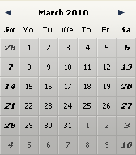
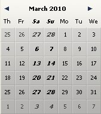

# DatePicker SET WEEK FIRST DAY

> DatePicker SET WEEK FIRST DAY ( ObjektName ; TagNum )

| Parameter | Type |     | Description |
| --- | --- | --- | --- |
| ObjektName | Text | → | Name des Objekts Unterformular |
| TagNum | Lange Ganzzahl | → | Nummer des ersten anzuzeigenden Tages |

## Beschreibung

Der Befehl `DatePicker SET WEEK FIRST DAY` setzt den ersten Tag der Woche, der im Kalender DatePicker links erscheint. Standardmäßig ist als erster Tag Montag eingestellt.

Der Parameter `ObjektName` spezifiziert die Instanz des Unterformulars, für welche die Funktion gelten soll. In diesem Parameter übergeben Sie den Namen des Objekts Unterformular, das im aktuellen Formular angezeigt wird.

Im Parameter `TagNum` übergeben Sie eine 4D Konstante unter dem Thema `Days and Months`:

| Konstante | Typ | Wert |
| --- | --- | --- |
| Sunday | Lange Ganzzahl | 1   |
| Monday | Lange Ganzzahl | 2   |
| Tuesday | Lange Ganzzahl | 3   |
| Wednesday | Lange Ganzzahl | 4   |
| Thursday | Lange Ganzzahl | 5   |
| Friday | Lange Ganzzahl | 6   |
| Saturday | Lange Ganzzahl | 7   |

### Beispiel 1  

Als ersten Tag Sonntag setzen:

```4d
 DatePicker SET WEEK FIRST DAY("mycalendar";Sunday)
```



### Beispiel 2  

Als ersten Tag Donnerstag setzen:

```4d
 DatePicker SET WEEK FIRST DAY("mycalendar";Thursday)
```



## Siehe auch

[DatePicker SET DAYS OFF](DatePicker%20SET%20DAYS%20OFF.de.md)  
[DatePicker SET DEFAULT 1ST DAY](DatePicker%20SET%20DEFAULT%201ST%20DAY.de.md)
