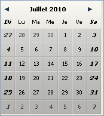
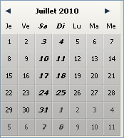

# DatePicker SET WEEK FIRST DAY

> DatePicker SET WEEK FIRST DAY ( nomObjet ; numJour )

| Paramètre | Type | | Description |
| --- | --- | --- | --- |
| nomObjet | Texte | → | Nom d'objet sous-formulaire |
| numJour | Entier long | → | Numéro du premier jour à afficher |

## Description

La commande `DatePicker SET WEEK FIRST DAY` permet de désigner le premier jour de la semaine à afficher dans la partie gauche d'un calendrier DatePicker. Par défaut, le premier jour est lundi.

Le `nomObjet` paramètre désigne l'instance de sous-formulaire à laquelle la commande doit être appliquée. Vous devez passer dans ce paramètre un nom d'objet sous-formulaire affiché dans le formulaire courant.

Passez dans le paramètre `numJour` une des constantes 4D suivantes du thème `Days and Months` :

| Constante | Type | Valeur |
| --- | --- | --- |
| Dimanche | Entier long | 1   |
| Lundi | Entier long | 2   |
| Mardi | Entier long | 3   |
| Mercredi | Entier long | 4   |
| Jeudi | Entier long | 5   |
| Vendredi | Entier long | 6   |
| Samedi | Entier long | 7   |

### Exemple 1  

Paramétrage du premier jour au dimanche :

```4d
 DatePicker SET WEEK FIRST DAY("moncalendrier";Dimanche)
```



### Exemple 2  

Paramétrage du premier jour au jeudi :

```4d
 DatePicker SET WEEK FIRST DAY("moncalendrier";Jeudi)
```



## Voir aussi

[DatePicker SET DAYS OFF](DatePicker%20SET%20DAYS%20OFF.fr.md)  
[DatePicker SET DEFAULT 1ST DAY](DatePicker%20SET%20DEFAULT%201ST%20DAY.fr.md)
