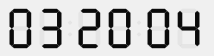

# TimePicker LCD AFFICHER AMPM

> TimePicker LCD DISPLAY AMPM ( nomObjet ; amPm )

| Paramètre | Type |     | Description |
| --- | --- | --- | --- |
| nomObjet | Texte | → | Nom d'objet sous-formulaire |
| amPm | Booléen | → | Vrai = afficher le symbole, Faux = ne pas l'afficher |

## Description

La commande `TimePicker LCD AFFICHER AMPM` permet d'afficher ou de masquer les lettres AM/PM placées à droite de l'objet de sous-formulaire `nomObjet` (horloge digitale uniquement).

Ces lettres sont utiles pour distinguer le matin de l'après midi lorsque l'horloge est en mode 12 heures (cf. [TimePicker LCD SET MODE](TimePicker%20LCD%20SET%20MODE.fr.md)).

Par défaut, les lettres sont affichées. Passez `Faux` dans `amPm` pour les masquer.

### Exemple  

On souhaite masquer les lettres AP/PM :

```4d
 TimePicker LCD DISPLAY AMPM("Subform1";Faux)
```



## Voir aussi

[TimePicker LCD SET MODE](TimePicker%20LCD%20SET%20MODE.fr.md)