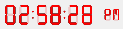

# TimePicker LCD SET COLOR

> TimePicker LCD SET COLOR ( ObjektName ; Farbe {; FarbeG ; FarbeB} )

| Parameter | Type |     | Description |
| --- | --- | --- | --- |
| ObjektName | Text | → | Name des Objekts Unterformular |
| Farbe | Lange Ganzzahl | → | Wert der RGB Farbe (4 bytes) oder Wert der roten Komponente (0..255), wenn die anderen Parameter übergeben sind |
| FarbeG | Lange Ganzzahl | → | Wert der grünen Komponente (0..255) |
| FarbeB | Lange Ganzzahl | → | Wert der blauen Komponente (0..255) |

## Beschreibung

Der Befehl `TimePicker LCD SET COLOR` setzt die Farben der Ziffern im Unterformular `ObjektName` (nur digitale Uhr).

Dieser Befehl akzeptiert zwei Syntaxarten:

* Übergeben Sie nur den Parameter `Farbe`, müssen Sie eine Lange Ganzzahl mit 4-byte im Format (0x00RRGGBB) übergeben. Die Bytes sind von rechts nach links von 0 bis 3 nummeriert:  

    |     |     |
    | --- | --- |
    | **Byte** | **Beschreibung** |
    | 3   | Muss Null sein für eine absolute RGB Farbe |
    | 2   | Rote Farbkomponente (0..255) |
    | 1   | Grüne Farbkomponente (0..255) |
    | 0   | Blaue Farbkomponente (0..255) |

* Sie können auch alle drei Parameter `Farbe`, `FarbeG` und `FarbeB` übergeben. Dann muss jeder Parameter eine Zahl zwischen 0 und 255 sein, die eine Komponente der RGB Farbe angibt.

### Beispiel  

Die Ziffern der LCD Anzeige in Rot ändern:

```4d
 TimePicker LCD SET COLOR("Subform1";0x00FF0000)  
  // lässt sich auch schreiben: TimePicker LCD SET COLOR ("Subform1";255;0;0)
```


