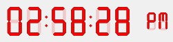

# TimePicker LCD SET COLOR

> TimePicker LCD SET COLOR ( objectName ; color {; colorG ; colorB} )

| 引数 | 型 |     | 説明 |
| --- | --- | --- | --- |
| objectName | テキスト | → | サブフォームオブジェクト名 |
| color | 倍長整数 | → | RGB カラーの値(4 bytes) または 他の引数が渡された場合には赤成分の値(0..255) |
| colorG | 倍長整数 | → | 緑成分の値 (0..255) |
| colorB | 倍長整数 | → | 青成分の値 (0..255) |

## 説明

**TimePicker LCD SET COLOR** コマンドは、`objectName` で指定したサブフォームオブジェクトの、数字の色を設定します。(ただしデジタル時計に限る)。

このコマンドには二つのシンタックスが使用できます:

* `color` 引数のみを指定する場合、(0x00RRGGBB) のフォーマットに適合する4バイトの倍長整数を渡します。(桁番号は右から左へ数えられ、0から3とナンバリングされています):  

    |     |     |
    | --- | --- |
    | **バイト** | **詳細** |
    | 3   | 絶対RGBカラーを指定するためには0でなければなりません。 |
    | 2   | カラーの赤成分 (0..255) |
    | 1   | カラーの緑成分 (0..255) |
    | 0   | カラーの青成分 (0..255) |

* それ以外に、3つの引数を渡す事もできます。: `color`, `colorG` そして `colorB` の3つです。この場合、それぞれの引数が0から255の間の数字である必要があり、それぞれがRGBカラーの要素となります。

### 例題

数字の表示を赤に変更する場合を考えます:

```4d
 TimePicker LCD SET COLOR("Subform1";0x00FF0000)
  // 別の記法: TimePicker LCD SET COLOR ("Subform1";255;0;0)
```


