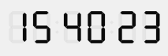

# TimePicker LCD SET MODE

> TimePicker LCD SET MODE ( objectName ; mode )

| Parameter | Type |     | Description |
| --- | --- | --- | --- |
| objectName | Text | → | Name of subform object |
| mode | Longint | → | 12 = display time in 12-hour mode, 24 = display time in 24-hour mode |

## Description

The `TimePicker LCD SET MODE` sets the display to either 12- or 24-hour mode for the `objectName` subform object (digital clock only).

By default, the object is displayed in 12-hour mode. You can pass the value 24 in the `mode` parameter if you want to switch to 24-hour mode. In this case, it is generally a good idea to hide the AM/PM as well (see the [TimePicker LCD DISPLAY AMPM](TimePicker%20LCD%20DISPLAY%20AMPM.es.md)).

### Example  

We want to switch to 24-hour mode and hide the AM/PM:

```4d
 TimePicker LCD SET MODE("Subform1";24)  
 TimePicker LCD DISPLAY AMPM("Subform1";False)
```



## See also

[TimePicker LCD DISPLAY AMPM](TimePicker%20LCD%20DISPLAY%20AMPM.es.md)
