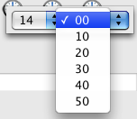

# TimePicker SET STEP

> TimePicker SET STEP ( ObjektName ; Schritt )

| Parameter | Type | | Description |
| --- | --- | --- | --- |
| ObjektName | Text | → | Name des Objekts Unterformular |
| Schritt | Zeit | → | Intervall zwischen zwei Zeitwerten |

## Beschreibung

Der Befehl `TimePicker SET STEP` setzt das Intervall zwischen Zeitwerten, die für das in ObjektName definierte Objekt verfügbar sind. Dieser Parameter gilt nur für TimePicker, die als PopUp-Menüs angezeigt werden.

Der Wert in Schritt muss zwischen 1 Minute und 1 Stunde liegen und als Division von 60 Minuten angezeigt werden. In der Praxis sind nur die Werte 1, 2, 3, 4, 5, 6, 10, 15, 20, 30 und 60 min möglich. Andere Werte werden automatisch gerundet, so dass sie dieses Prinzip berücksichtigen.

### Beispiel

TimePicker in Form eines PopUp-Menüs mit Namen Zeit1 erstellen, mit eingebbaren Zeiten von 8:30 bis 16:30 mit einen Intervall von 10 Minuten:

```4d
 TimePicker SET MIN TIME("Zeit1";?08:30:00?)
 TimePicker SET MAX TIME("Zeit1";?16:30:00?)
 TimePicker SET STEP("Zeit1";?00:10:00?)
```



## Siehe auch

[TimePicker SET DEFAULT STEP](TimePicker%20SET%20DEFAULT%20STEP.md)
