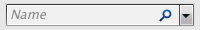
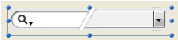

# SearchPicker

## Présentation

Le widget SearchPicker vous permet de créer facilement des zones standard de recherche, semblables à celles que l’on peut trouver dans les navigateurs ou les barres d’outils. L’apparence de la zone dépend de la plate-forme.

**Windows :**  
  
**MacOS :**  

Le texte affiché par défaut dans la zone peut être contrôlé par programmation, à l’aide de la méthode composant [SearchPicker SET HELP TEXT](Methods/SearchPicker%20SET%20HELP%20TEXT.fr.md).

### Fonctionnement

Hormis son apparence, une zone de recherche SearchPicker se caractérise par les éléments suivants : un texte grisé, une zone de saisie et une icône d’effacement.

- **Zone de saisie :** Permet à l’utilisateur de saisir la valeur à rechercher. Cette valeur est automatiquement et dynamiquement affectée à la variable que vous avez associée à la zone dans la Liste des propriétés (propriété "Nom de la variable"). Vous utilisez cette variable pour fournir la valeur recherchée à la méthode de recherche.
- **Texte grisé :** Une aide indiquant à l’utilisateur le ou les champ(s) où la recherche sera effectuée. Il disparaît dès que la zone a le focus. Ce texte peut être défini via la méthode composant [SearchPicker SET HELP TEXT](Methods/SearchPicker%20SET%20HELP%20TEXT.fr.md).
- **Bouton d’effacement :** Permet d’effacer le contenu de la zone. Son fonctionnement est automatique.

En exécution, vous pouvez lancer votre méthode de recherche via un clic sur un bouton du formulaire ou dans un événement formulaire. La zone génère notamment les événements **Sur données modifiées** et **Sur perte focus**. Vous pouvez proposer une recherche dynamique réévaluée à chaque caractère saisi par l’utilisateur en appelant la méthode de recherche dans l’événement **Sur données modifiées**.

### Création

Vous pouvez insérer une zone SearchPicker dans un formulaire de deux manières :

1. En insérant un objet "Zone de recherche" depuis la bibliothèque d’objets préconfigurés de 4D (thème "Zones de saisie").
2. En créant une zone de sous-formulaire et en lui affectant le formulaire détaillé **SearchPicker**.  
   

Définissez ensuite le nom de la variable associée au sous-formulaire (propriété "Nom de la variable" dans la Liste des propriétés). À l’exécution du formulaire, cette variable contiendra automatiquement la valeur recherchée par l’utilisateur. Il vous suffit alors de passer cette valeur à votre méthode de recherche personnalisée.
