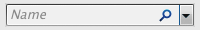
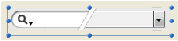

# SearchPicker

## 概要

SearchPickerウィジェットを使用して、ブラウザやツールバーに見られるような標準の検索エリアを簡単に作成できます。エリアのアピアランスはプラットフォームに依存します。

Windows:  Mac OS: 

デフォルトでエリアに表示されるテキストは、[SearchPicker SET HELP TEXT](Methods/Methods/SearchPicker%20SET%20HELP%20TEXT.ja.md)コンポーネントメソッドを使用して、プログラムでコントロールできます。

## 動作

アピアランスの他、SearchPicker検索エリアは以下の要素による特徴を持っています: グレイアウトされたテキスト、入力エリア、削除アイコン。

* 入力エリアには検索する値を入力します。この値はプロパティリストの変数名プロパティを使用してエリアにバインドした変数に自動および動的に代入されます。この変数を使用して検索する値を取り出し、検索メソッドに渡すことができます。
* グレイアウトされたテキストは、検索が実行されるフィールドをユーザに補助的に提示するものです。エリアにフォーカスが当たるとテキストは消えます。このテキストは[SearchPicker SET HELP TEXT](Methods/Methods/SearchPicker%20SET%20HELP%20TEXT.ja.md)コマンドで設定できます。
* 削除ボタンはエリアの内容を消去するために使用します。このボタンは自動で動作します。

実行中、フォーム内カスタムボタンのクリックやフォームイベントを使用して検索メソッドを起動できます。エリアは特に`On Data Change`や`On Losing Focus`イベントを生成します。`On Data Change`イベントで検索メソッドを呼び出すことで、ユーザが他の文字を入力するたびに再評価を行うような動的検索を提供できます。

## 作成

フォーム上にSearchPickerエリアを挿入する方法は2つあります:

* 4Dの定義済みオブジェクトライブラリから"SearchPicker "エリアを挿入する ("入力エリア" テーマ)。
* サブフォームエリアを作成し、**SearchPicker**詳細フォームを割り当てる。

そのうえで、サブフォームにバインドする変数の名前を指定します (プロパティリストの"変数名"プロパティ)。フォームが実行されると、この変数は自動でユーザーが検索のために入力した値が代入されます。この値をカスタム検索メソッドに渡すことができます。
