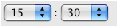
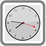
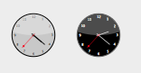
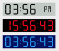

# 🧩 TimePicker et TimeEntry

Le widget TimePicker propose des objets simples d’emploi que vous pouvez utiliser pour valoriser des champs nécessitant la saisie d’heures ou afficher des heures. Il est utilisable sous différentes formes :

* Menu pop-up simple ou double :  
     

* Zone de saisie d’heures au format "hh:mm:ss" associées à un stepper numérique permettant d’augmenter ou de réduire les valeurs d’heures, minutes ou secondes :  
    

* Horloge (_TimeDisplay_) ou horloge digitale (_TimeDisplayLCD_) :  
     

En outre, chaque type de TimePicker peut afficher l’heure sur 12 heures (AM-PM) ou 24 heures.

Un objet TimePicker peut être utilisé sans programmation grâce aux mécanismes fournis par la variable associée. Toutefois, vous pouvez personnaliser le fonctionnement des objets TimePicker à l'aide des méthodes composant qui sont fournies.

## Création et configuration

Vous pouvez insérer une zone TimePicker dans un formulaire de deux manières :

* En déposant un objet "TimePicker", "Zone de saisie d'heure" ou "Zone d'affichage d'heure" depuis la bibliothèque d’objets préconfigurés de 4D.
* En créant une zone de sous-formulaire et en lui affectant le formulaire détaillé **TimePicker**, **TimeEntry**, **TimeDisplay** ou **TimeDisplayLCD** selon votre choix.

Définissez ensuite le nom de la variable associée au sous-formulaire (propriété "Nom de la variable" dans la Liste des propriétés). À l’exécution du formulaire, cette variable contiendra automatiquement l’heure définie par l’utilisateur. À l’inverse, si vous modifiez par programmation la valeur de cette variable, elle sera automatiquement représentée dans le sous-formulaire. Vous pouvez aussi ne pas nommer de variable afin de bénéficier du mécanisme des variables dynamiques.

#### À propos des horloges

Les widgets "horloge" sont dessinés en SVG, ils bénéficient donc d’un tracé vectoriel autorisant les déformations en mode Application (en mode Développement, leur taille est fixe) :


À noter que :

* Dans l'horloge standard, la trotteuse peut être affichée ou masquée à l’aide de la méthode [TimePicker DISPLAY SECOND HAND](Methods/TimePicker%20DISPLAY%20SECOND%20HAND.fr.md).
* L’horloge standard passe automatiquement en "mode jour" ou "mode nuit" en fonction de l’heure :  
      
    Les plages horaires sont 8:00:00 -> 19:59:59 = Jour, 20:00 -> 07:59:59 = Nuit.
* Le widget "horloge digitale" est transparent et sans arrière-plan, il peut donc être placé au-dessus d’objets colorés afin de varier les rendus :  
      
    Vous disposez de plusieurs options d’affichage pour ce widget, accessibles via les méthodes composant débutant par "TimePicker LCD".

**Note :** Les développeurs peuvent remplacer le dessin de l’horloge standard par leurs propres créations en remplaçant le fichier "clock.svg" situé au premier niveau du dossier "Resources".

## Afficher l’heure courante ou une heure statique

Les horloges peuvent soit afficher dynamiquement l’heure courante soit afficher une heure statique.

* Pour afficher **l’heure courante**, associez une **variable numérique** à l’objet sous-formulaire du widget (fonctionnement par défaut). Dans ce cas, le widget affiche automatiquement l’heure courante et fonctionne comme une pendule.  
    Vous pouvez appliquer un décalage à l’heure affichée : la valeur de la variable numérique indique le décalage en secondes. Par exemple, 3600 = avancer la pendule d’une heure, -1800 = reculer la pendule de 30 minutes, etc.

* Pour afficher une **heure statique**, associez une **variable Heure** à l’objet sous-formulaire du widget (par le biais de la commande [C_TIME](https://developer.4d.com/docs/Concepts/time) ou de la Liste des propriétés). L’horloge affiche alors la valeur de cette variable.

Par exemple, on souhaite afficher 10:10:30 :

```4d
C_TIME(myvar) // myvar est le nom de la variable du widget  
myvar:=?10:10:30?
```