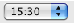
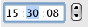
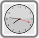
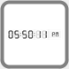
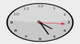
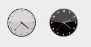
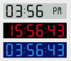

# 🧩 TimePicker と TimeEntry  

TimePickerウィジェットは時間の入力や表示をさらにアトラクティブに行えるフィールドを作成するための簡単に使用できるオブジェクトを提供します。以下の形にて使用することができます:

* 1つ、または2つのポップアップ:  
     

* 数値ステッパーに関連付けられた "hh:mm:ss" フォーマットの時間入力エリア(数値ステッパーは時間、分、秒をそれぞれ増減させるのに使用します):  
    

* 時計(_TimeDisplay_)またはデジタル時計(_TimeDisplayLCD_):  
     

さらにそれぞれのタイプのTimePickerは12時間 (AM-PM) または24時間形式で時間を表示できます。

TimePickerオブジェクトは、バインド変数により提供されるメカニズムのおかげで、プログラムなしで使用できます。しかしTimePickerオブジェクトの動作をカスタマイズしたい場合は、提供されるコンポーネントメソッドを使用しなければなりません。

## 作成と利用  

TimePickerエリアをフォームに挿入する方法は2つあります:

* 4Dの定義済みオブジェクトライブラリから"TimePicker"または"TimeEntry"を挿入する。
* サブフォームエリアを作成し、**TimePicker**または**TimeEntry**詳細フォームを割り当てる。

そのうえで、サブフォームにバインドする変数の名前を指定します (プロパティリストの"変数名"プロパティ)。フォームが実行されると、この変数は自動でユーザーが指定した時間が代入されます。逆にこの変数の値をプログラムで更新すると、自動でサブフォームに反映されます。変数に名前を与えないことにより、フォームローカル変数の利点を生かすこともできます。

#### 時計について(v14よりの新機能)  

Clock ウィジェットはSVGで描画されているので、ヴェクターパスをもち、それ故にアプリケーションモードでは自在に変形することが出来ます(デザインモードではサイズは固定です):



更に、以下の様な機能もあります:

* 時計の秒針は、[TimePicker DISPLAY SECOND HAND](Methods/Methods/TimePicker%20DISPLAY%20SECOND%20HAND.ja.md)メソッドを使用することにより表示したり隠したりすることが出来ます。
* 時計は、時刻に応じて"昼間モード"と"夜間モード"を切り替えます:  
      
    昼間と夜間の時刻の範囲はそれぞれ、  
    8:00:00 -> 19:59:59 = 昼間  
    20:00 -> 07:59:59 = 夜間  
    となっています。
* "デジタル時計"のウィジェットは透明なので色のあるオブジェクトに重ねて色を変えることも出来ます:  
      
    コンポーネントメソッドには表示のオプションに関する様々なメソッドが用意されています。これらのメソッドには"TimePicker LCD"の接頭辞がついています。

**注:** この時計は"Resources"フォルダーの第一レベルにある"clock.svg"を置き換えることにより削除したりデベロッパ自身の作成したオブジェクトで置き換えたりすることができます。

## カレントの時刻または静的な時刻の表示  

時計にはカレントの時刻を動的に表示させるか、または静的な時間を表示させることができます。

* **カレントの時刻**を表示させ、時計のように動作させるためには: 
    * **変数**をデータソースとして使用する場合、ウィジェットのサブフォームオブジェクトに**整数**型の変数を割り当てます(デフォルト)。
    * **オブジェクトプロパティ**をデータソースとして使用する場合(例 *Form.myTime*)、ウィジェットのサブフォームオブジェクトに**整数**型もしくは**時間**型の値を割り当てます。

    **注意:** 表示される時刻にオフセットを適用することができます: 数値変数の値は秒単位でのオフセットを表します。例えば、3600 = 時計を1時間進める、-1800 = 時計を30分戻す、となります。

* **静的な時刻**を表示したい場合:
    * **変数**をデータソースとして使用する場合、ウィジェットのサブフォームオブジェクトに(ランゲージまたはプロパティリストを使用して)**時間**型もしくは**テキスト**型の値を割り当てます。
    * **オブジェクトプロパティ**をデータソースとして使用する場合(例 Form.myTime)、ウィジェットのサブフォームオブジェクトに**テキスト**型の値を割り当てます。

例えば、時計に10:10:30を表示させたい場合:

* 変数がデータソースの場合:

```4d
 C_TIME(myTime) // myTime がウィジェットのデータソース
 myTime:=?10:10:30?
 
  // 以下と同等:
 C_TEXT(myOtherTime) // myOtherTime がウィジェットのデータソース
 myOtherTime:="10:10:30"
```

* オブジェクトプロパティがデータソースの場合:

```4d
 Form.myTime:="10:10:30" // Form.myTime がウィジェットのデータソース
```


