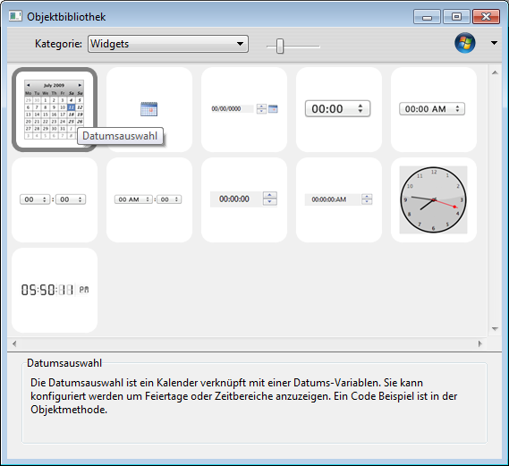

# 4D Widgets

4D Widgets sind Funktionalitäten in Form von Komponenten, die über den Formulareditor bzw. die vorkonfigurierte Objektbibliothek zugänglich sind. Diese Widgets sind komplexe Objekte mit vordefinierten Merkmalen, die Zugriff auf Standardfunktionalitäten bieten und sich leicht integrieren lassen.

Drei Widgets sind verfügbar:

- [SearchPicker](Documentation/SearchPicker.de.md): Bereich für die Suche mit Standardaussehen.
- [DatePicker](Documentation/DatePicker.de.md): Selector für Datum.
- [TimePicker](Documentation/TimePicker.de.md): Selector für Zeit.

 > Diese Widgets sind mit oder ohne Programmierung verwendbar. Sie können sie mühelos in Ihre Formulare integrieren und mit ihren Standardeigenschaften verwenden.
 > Wollen Sie die Widgets nach eigenen Vorstellungen steuern und konfigurieren, können Sie spezifische Projektmethoden, genannt "Komponent-Methoden" verwenden.


Diese Dokumentation beschreibt die Widgets und die Syntax der dazugehörigen Komponent-Methoden.

## Widget hinzufügen

Es gibt zwei Möglichkeiten, ein Widget Bereich in ein Formular einzufügen:

- Über die Objektbibliothek
- Über ein Unterformular

### Über die Objektbibliothek

Um ein Widget über die Objektbibliothek einzufügen:

1. Wählen Sie im Menü **Design** den Befehl **Objektbibliothek**.  
    Auf dem Bildschirm erscheint das Dialogfenster Objektbibliothek.
2. Wählen Sie im DropDown-Menü **Kategorie** den Eintrag **Widgets**.  
    Alle verfügbaren Widgets werden aufgelistet:  
    
3. Fügen Sie das gewünschte Widget per Drag-and-Drop in Ihr Formular ein.  
    Sie können es dann über die Eigenschaften des eingefügten Objekts bzw. über seine Objektmethode konfigurieren.

### Über ein Unterformular

Um ein Widget über ein Objekt vom Typ Unterformular einzufügen:

1. Fügen Sie im Formulareditor ein Objekt Unterformular hinzu.  
    Weitere Informationen dazu finden Sie im Handbuch 4D _Designmodus_.
2. Klicken Sie in der Eigenschaftenliste auf das Menü "Detail Formular", um durch die Liste der verwendbaren Formulare zu scrollen. Diese Liste enthält auch die Widgets.  
    
3. Wählen Sie das gewünschte Widget.  
    Sie können es dann über die Objekteigenschaften oder die Objektmethode des Unterformulars konfigurieren.

## Widgets auf Seite 2 und weiteren initialisieren

Da Widgets auf 4D Unterformularen basieren, gelten hierfür dieselben Prinzipien wie für Unterformulare. Beachten Sie insbesondere die Initialisierung.

Aus Optimierungsgründen führt 4D Unterformularobjekte nur aus (Instanzierung), wenn das Unterformular angezeigt wird, d.h. Methodenaufrufe über [EXECUTE METHOD IN SUBFORM](https://developer.4d.com/docs/FormObjects/subformOverview/#execute-method-in-subform-command) oder Zugriff auf dynamische Objekte in Unterformularen ist erst möglich, wenn das Unterformular auf der aktuellen Seite angezeigt wird.

Setzen Sie Widgets auf andere Formularseiten als Seite 1, lässt sich keine Initialisierungsmethode (wie [TimePicker SET STEP](Documentation/Methods/TimePicker%20SET%20STEP.de.md)) im Formularereignis On Load aufrufen, da das Widget zum Zeitpunkt der Methodenausführung nicht instanziert ist.

Um das zu verwalten, geben Widget-Bereiche ein spezifisches Ereignis mit dem Wert -1 zurück, um anzuzeigen, dass sie geladen und einsatzbereit sind. Dieses Ereignis muss auf der Ebene der Objektmethode des Widgets selbst getestet werden, und zwar genauso wie die Konstanten On Data Change, On Load etc. Liegt das Widget nicht auf Seite 1 des Formulars, müssen Sie folgenden Code schreiben:

```4d
 If(FORM Event=-1) // Das Widget ist instanziert und kann initialisiert werden  
    TimePicker SET STEP("myTimePicker";? 00:10:00?) // Beispiel  
 End if
```

und nicht:

```4d
 If(FORM Event code=On Load) // Funktioniert nur, wenn das Widget auf Seite 1 liegt  
    TimePicker SET STEP("myTimePicker";? 00:10:00?)  
 End if
```
