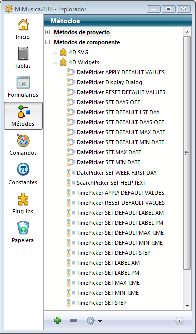
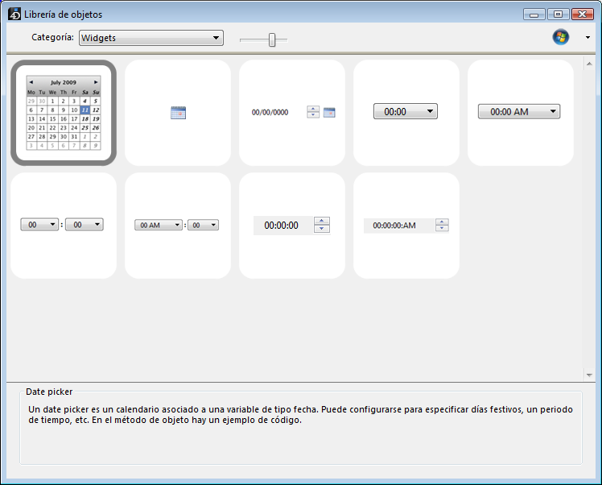
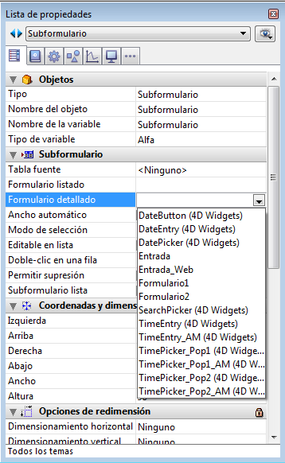

# 4D Widgets

Los widgets 4D son funcionalidades ofrecidas como componentes, accesibles desde el editor de formularios y la librería de objetos preconfigurados. Estos widgets son objetos compuestos con características predefinidas que facilitan el acceso a las funcionalidades estándar y son muy sencillos de implementar.

Tres widgets están disponibles:

- [SearchPicker](Documentation/SearchPicker.es.md): área de búsqueda con apariencia estándar.
- [DatePicker](Documentation/DatePicker.es.md): selector de fecha.
- [TimePicker](Documentation/TimePicker.es.md): selector de hora.

 > Estos widgets se pueden utilizar con o sin programación. Puede simplemente integrarlos en sus formularios y utilizar sus propiedades por defecto.
 > <br>Si quiere controlarlos y configurarlos de una manera más personalizada, puede hacer uso de los métodos proyecto específicos, llamados "Métodos componente".



Esta documentación cubre cada widget y describe la sintaxis de los métodos componente asociados a él.

## Añadir un widget

Hay dos formas de insertar un área de widget en un formulario:

- Utilizar la librería de objetos
- Utilizar un subformulario

### Vía la librería de objetos

Para insertar un widget vía la librería de objetos:

1. Seleccione el comando **Librería de objetos** en el menú **Diseño**.  
    Aparece la ventana de la librería de objetos.
2. Seleccione **Widgets** en el menú Categorías.  
    Se listan los widgets disponibles:  
    
3. Inserte el widget deseado en su formulario por arrastrar y soltar.  
    Luego puede configurarla vía las propiedades del objeto insertado o vía su método objeto.

### Vía un subformulario

Para crear un widget vía un objeto de tipo subformulario:

1. En el editor de formularios, añada un objeto subformulario.  
    Este punto se describe en el manual de Diseño 4D.
2. En la lista de propiedades, haga clic en el menú "Formulario detallado" con el fin de mostrar la lista de formularios utilizables. Esta lista incluye los widgets.  
    
3. Seleccione el widget a insertar.  
    Luego puede configurarlo vía las propiedades del objeto o el método objeto del subformulario.

## Inicialización de widgets en la página 2 y siguientes

Los widgets se basan en subformularios 4D y por lo tanto, están sujetos a los mismos principios operativos. Debe prestar atención especial a su inicialización.

Para fines de optimización, los objetos de subformulario son instanciados por 4D sólo cuando se muestra el subformulario. Esto significa que las llamadas de método a través de [EXECUTE METHOD IN SUBFORM](https://developer.4d.com/docs/FormObjects/subformOverview/#execute-method-in-subform-command) o el acceso a objetos dinámicos en subformularios no es posible hasta que el subformulario se muestre en la página actual.

Cuando coloque widgets en páginas de formulario distintas de la página 1, no es posible llamar a un método de inicialización (tal como [TimePicker SET STEP](Documentation/Methods/TimePicker%20SET%20STEP.es.md)) en el evento de formulario On Load, porque en el momento de su ejecución el widget no será instanciado.

Para manejar este caso, las áreas de widget devuelven un evento específico con un valor de -1 para indicar que están cargadas y listas para su uso. Este evento debe ser probado al nivel de método de objeto del propio widget, de la misma manera que On Data Change, On Load etc. Por lo tanto cuando el widget esté ubicado en una página de formulario que no sea la página 1, es necesario escribir:

```4d
 If(FORM Event=-1) // el widget está instanciado y puede ser inicializado  
    TimePicker SET STEP("myTimePicker";? 00:10:00?) // ejemplo  
 End if
```

en lugar de:

```4d
 If(FORM Event code=On Load) // sólo funciona si el widget está en la página 1  
    TimePicker SET STEP("myTimePicker";? 00:10:00?)  
 End if
```