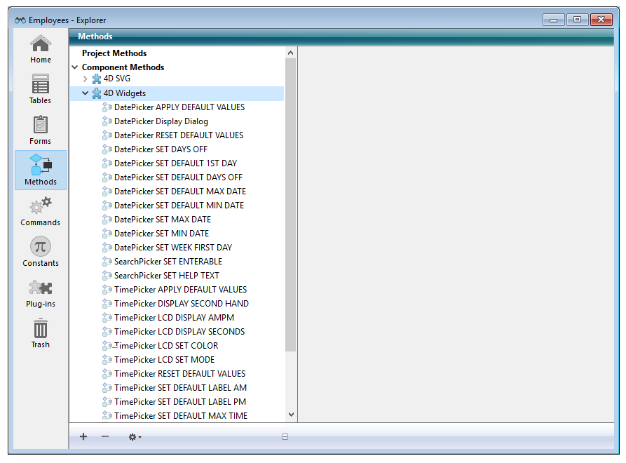
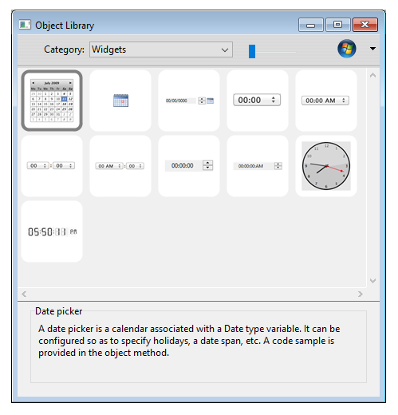
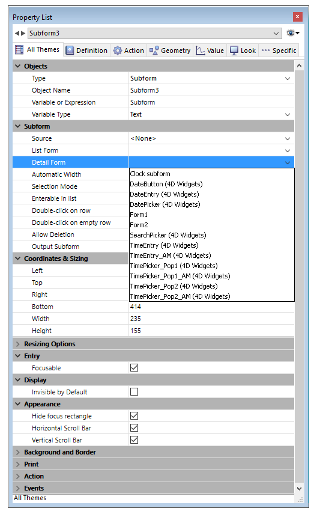

# Widgets 4D

Les widgets 4D sont des fonctionnalités fournies sous forme de composants. Accessibles depuis l'éditeur de formulaires et la bibliothèque d'objets préconfigurés, ces widgets sont des objets composés disposant de caractéristiques prédéfinies et donnant accès à des fonctionnalités standard très simples à mettre en œuvre.

Trois widgets sont disponibles :

- [SearchPicker](Documentation/SearchPicker.fr.md) : zone de recherche d’apparence standard.
- [DatePicker](Documentation/DatePicker.fr.md) : sélecteur de date.
- [TimePicker](Documentation/TimePicker.fr.md) : sélecteur d’heure.

> Ces widgets sont utilisables avec ou sans programmation. Vous pouvez les intégrer simplement dans vos formulaires et utiliser leurs propriétés par défaut.  
> Si vous souhaitez pouvoir les contrôler et les paramétrer de façon plus personnalisée, il vous suffit de faire appel à des méthodes projet spécifiques, appelées "Méthodes composant". Ces méthodes sont listées par composant dans la page Méthodes de l’Explorateur.



Cette documentation présente chaque widget et décrit la syntaxe des méthodes composant qui lui sont associées.

## Ajouter un widget  

Pour insérer une zone de widget dans un formulaire, vous disposez de deux possibilités :

- Utiliser la bibliothèque d'objets
- Utiliser un sous-formulaire

### Via la bibliothèque d'objets  

Pour insérer un widget via la bibliothèque d'objets :

1. Sélectionnez la commande **Bibliothèque d'objets** dans le menu **Développement**.  
    La fenêtre de la Bibliothèque d'objets préconfigurés apparaît.
2. Sélectionnez **Widgets** dans le menu **Catégories**.  
    Les widgets disponibles sont listés :  
    
3. Insérez le widget souhaité dans votre formulaire par glisser-déposer.  
    Vous pouvez ensuite le configurer via les propriétés de l'objet inséré ou sa méthode objet.

### Via un sous-formulaire  

Pour créer un widget via un objet de type sous-formulaire :

1. Dans l'éditeur de formulaires, ajoutez un objet sous-formulaire.  
    Ce point est décrit dans le manuel _Mode Développement_ de 4D.
2. Dans la liste des propriétés, déroulez le menu "Formulaire détaillé" afin d'afficher la liste des formulaires utilisables. Cette liste inclut les widgets.  
    
3. Sélectionnez le widget à insérer.  
    Vous pouvez ensuite le configurer via les propriétés de l'objet ou la méthode objet du sous-formulaire.

## Initialisation des widgets en page 2 et suivantes  

Les widgets sont basés sur des sous-formulaires 4D et sont donc soumis aux mêmes principes de fonctionnement. Vous devez notamment porter une attention particulière à leur initialisation.

Pour des raisons d'optimisation, les objets des sous-formulaires sont instanciés par 4D uniquement lorsque le sous-formulaire est affiché. Cela signifie que les appels de méthodes via [EXECUTER METHODE DANS SOUS FORMULAIRE](https://developer.4d.com/docs/fr/FormObjects/subformOverview#execute-method-in-subform-command) ou l'accès aux objets dynamiques des sous-formulaires sont impossibles tant que le sous-formulaire n'est pas affiché sur la page courante.

Lorsque vous placez des widgets sur des pages de formulaires autres que la page 1, il n'est donc pas possible d'appeler une méthode d'initialisation (telle que [TimePicker SET STEP](Documentation/Methods/TimePicker%20SET%20STEP.fr.md)) dans l'événement formulaire **Sur chargement**, car au moment de son exécution le widget ne sera pas instancié.

Pour traiter ce cas, les zones de widgets retournent un événement spécifique de valeur -1 pour indiquer qu'ils sont chargés et prêts à être utilisés. Cet événement doit être testé au niveau de la méthode objet du widget lui-même, au même titre que les **Sur données modifiées**, **Sur chargement**, etc. Il est donc nécessaire d'écrire, lorsque le widget est situé sur une page de formulaire autre que la page 1 :

```4d
 Si(Evenement formulaire=-1) // le widget est instancié et peut être initialisé  
    TimePicker SET STEP("myTimePicker";?00:10:00?) // exemple  
 Fin de si
```

plutôt que :

```4d
 Si(Evenement formulaire=Sur chargement) // fonctionne uniquement si le widget est en page 1  
    TimePicker SET STEP("myTimePicker";?00:10:00?)  
 Fin de si
```
