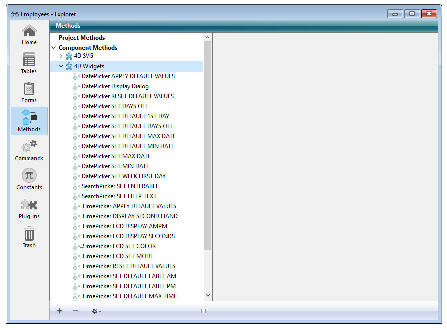
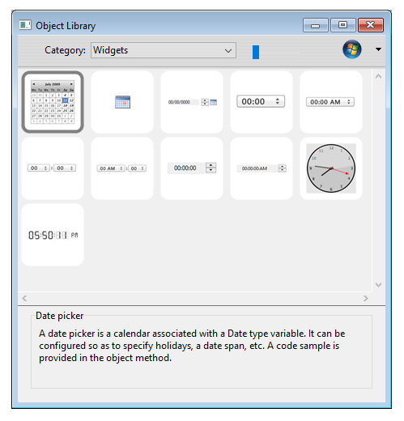

# 4D widgets

Os widgets 4D são funcionalidades oferecidas como componentes, acessíveis desde o editor de formulários e a livraria de objetos configurados. Estes widgets são objetos compostos com características predefinidas que facilitam o acesso as funcionalidades padrão e são muito simples de implementar.

Três widgets estão disponíveis:

- [SearchPicker](Documentation/SearchPicker.pt.md): área de busca com aparência padrão.
- [DatePicker](Documentation/DatePicker.pt.md): seletor de data.
- [TimePicker](Documentation/TimePicker.pt.md): seletor de hora.

 > Estes widgets podem ser utilizados com ou sem programação. Podem simplesmente integrados em seus formulários e utilizar suas propriedades por padrão.
 > <br>Se quer controlar e configurar eles de uma forma mais personalizada, pode fazer uso dos métodos projeto específicos, chamados "Métodos componente", listados por componente.



Esta documentação cobre cada widget e descreve a sintaxes dos métodos componente associados a ele.

## Agregar um widget

Há duas formas de inserir uma área de widget em um formulário:

- Utilizar a livraria de objetos
- Utilizar um subformulário

### Via a livraria de objetos

Para inserir um widget via a livraria de objetos:

1. Selecione o comando **Livraria de objetos** no menu **Desenho**.  
    Aparece a janela da livraria de objetos.
2. Selecione **Widgets** no menu Categorias.  
    Se listam os widgets disponíveis:  
    
3. Insira o widget desejado em seu formulário por arrastar e soltar.  
    Depois pode configurar sob as propriedades do objeto inserido ou sob seu método objeto.

### Via um subformulário

Para criar um widget via um objeto de tipo subformulário:

1. No editor de formulários, agregue um objeto subformulário.  
    Este ponto se descreve no manual de Desenho 4D.
2. Na lista de propriedades, faça clique no menu "Formulário detalhado" com o fim de mostrar a lista de formulários utilizáveis. Esta lista inclui os widgets.  
    
3. Selecione o widget a inserir.  
    Depois pode configurar sob as propriedades do objeto ou o método objeto do subformulário.

## Initializar widgets da página 2 em diante

Os Widgets estão baseados em subformulários 4D e estão portanto sujeitos aos mesmos princípios operativos. Deve prestar atenção particular em sua inicialização.

Para propósitos de operação, objetos de subformulário são incializados por 4D só quando o subformulário for exibido. Isso significa que chamadas de método via [EXECUTE METHOD IN SUBFORM](https://developer.4d.com/docs/FormObjects/subformOverview/#execute-method-in-subform-command) ou acessar os objetos dinâmicos em subformulários não são possíveis até o subformulário ser exibido na página atual.

Quando colocar widgets nas páginas de formulário outros que a página 2, não é possível chamar um método de inicialização (tais como [TimePicker SET STEP](Documentation/Methods/TimePicker%20SET%20STEP.pt.md)) no evento de formulário On Load, porque no momento de sua execução não será instanciado.

Para manejar esse caso, áreas de widget retornam um evento específico com um valor de -1 para indicar que elas são carregadas e prontas para usar. Esse evento pode ser testado ao nível do método de objeto do próprio widget, do mesmo modo que On Data Change, On Load etc. Portanto quando o widget estiver localizado na página de formulário outro que a página 1, é necessário escrever:

```4d
 If(FORM Event=-1) // o widget é instanciado e pode ser inicializado  
    TimePicker SET STEP("myTimePicker";? 00:10:00?) // exemplo  
 End if
```

ao invés de:

```4d
 If(FORM Event code=On Load) // só funciona se o widget estiver na página 1  
    TimePicker SET STEP("myTimePicker";? 00:10:00?)  
 End if
```